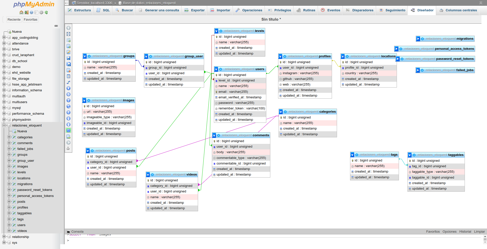

# Eloquent: Relaciones

Desarrollado para practicar y ver en funcionamiento todas las posibles relaciones que se pueden establecer entre las tablas de una aplicación web:

-   Uno a uno
-   Uno a muchos
-   Muchos a muchos
-   Uno a uno a través de
-   Relaciones polimórficas:
    -   Uno a uno
    -   Uno a muchos
    -   Muchos a muchos

## Tecnologías

-   PHP 8.1
-   Laravel 10.34.2
-   Tailwind 3.3.6
-   FakerPHP 1.9.1
-   MySQL 8.0.35
-   Apache 2.4.52

## Para Ejecutar

```
git clone https://github.com/drfcozapata/relaciones-eloquent.git

npm install

composer install (o composer update)
```

Crear la base de datos (relaciones_eloquent)

```
cp .env.example .env
```

Configurar datos de mysql en .env

```
php artisan serve
```

## Demo y Repo

-   [Relaciones Eloquent](https://relaciones.doulos-dev.net/)
-   [GitHub](https://github.com/drfcozapata/relaciones-eloquent)

## Medios

Todas las imágenes son generadas de forma aleatoria desde links que llevan a:

-   Imágenes de "posts" y "videos": https://picsum.photos
-   Imágenes de perfil de usuarios: https://i.pravatar.cc

## Imágenes



